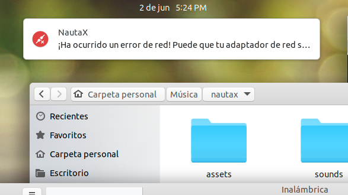
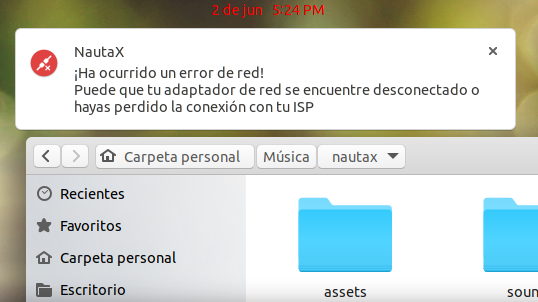

# NautaX v 1.0

Monitoriar acceso a Internet y Nauta

Cuando su sistema tenga acceso a internet, NautaX le enviara una notificacion de escritorio, asi como sonora.
Ideal para redes SNETS con acceso a Nauta

## Instalacion
#### Dependencias
* curl
* notify-send (Notificaciones visuales)
* aplay  (Notificaciones sonoras)
#### Generic
<pre>
git clone https://github.com/AnonymousWebHacker/nautax
cd nautax
chmod +x nautax
./nautax
</pre>

#### Mejoras
* Notificara conexion a internet
* Notificara cuando pierda su conexion a internet
* Notificara si tiene algun problema de redes

#### Mas adelante?
* Crear un paquete deb para instalar nautax en el sistema
* Integrar nautax y mostrar icono en la barra de estado
* Servicio Arrancar con el sistema.
* Notificar si tiene acceso al portal Nauta

